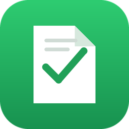
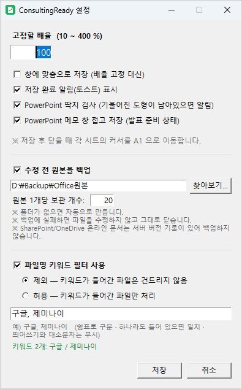
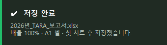
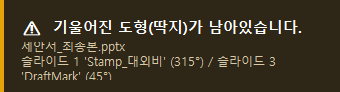
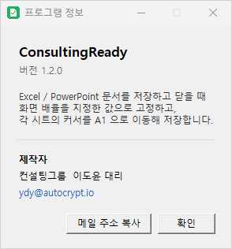

<p align="center">
  
</p>

<h1 align="center">ConsultingReady</h1>

<p align="center">
  <a href="../../releases/latest"></a>
  <a href="LICENSE"></a>
</p>

**Excel · PowerPoint 문서를 저장하고 닫을 때, 자동으로 "내보낼 준비 상태"로 정리하고 점검해 주는 Windows 백그라운드 프로그램입니다.**

보고서를 공유하거나 발표하기 직전에 매번 손으로 하던 일 — 배율을 100%로 되돌리고, 커서를 A1로 올리고, 첫 시트를 띄우고, 발표자 메모 창을 접고, "대외비" 딱지가 남았는지 확인하는 일 — 을 문서를 닫는 순간에 알아서 처리합니다.

시스템 트레이에 상주하며, 사용자가 **의도적으로 저장한 문서를 닫을 때만** 동작합니다.

<p align="center">
  
</p>

---

## 목차

- [주요 기능](#주요-기능)
- [설치](#설치)
- [빠른 시작](#빠른-시작)
- [설정](#설정)
- [언제 동작하나요](#언제-동작하나요)
- [기능 상세](#기능-상세)
- [문제 해결](#문제-해결)
- [알려진 제약](#알려진-제약)
- [직접 빌드하기](#직접-빌드하기)
- [제작자](#제작자)

---

## 주요 기능

| 기능 | 설명 | Excel | PowerPoint |
|---|---|:---:|:---:|
| **배율 고정** | 지정한 배율(10~400%)로 맞춰 저장 | ✅ | 🔸 |
| **창에 맞춤** | 배율 고정 대신 창에 맞춤 상태로 저장 | — | ✅ |
| **커서 A1 이동** | 모든 시트의 커서를 A1로, 화면도 좌상단으로 | ✅ | — |
| **첫 시트 활성화** | 다시 열면 1번 시트가 보이도록 | ✅ | — |
| **메모 창 접기** | 발표자 노트 창을 접어 발표 준비 상태로 | — | ✅ |
| **딱지 검사** | 기울어진 도형(대외비·초안 등)이 남아있으면 경고 | — | ✅ |
| **원본 백업** | 수정 전 원본을 별도 폴더에 복사 | ✅ | ✅ |
| **파일명 키워드 필터** | 키워드가 들어간 파일을 제외하거나 그 파일만 처리 | ✅ | ✅ |
| **일시정지** | 잠시 모든 동작 중지 | ✅ | ✅ |

🔸 PowerPoint 배율은 best-effort입니다 ([알려진 제약](#알려진-제약) 참고)

---

## 설치

1. [Releases](../../releases) 에서 최신 **`ConsultingReady.exe`** 를 내려받습니다.
2. 원하는 폴더에 두고 더블클릭하면 끝입니다. 별도 설치 과정이 없습니다.
3. 창은 뜨지 않고, 화면 우측 하단 **트레이에 초록색 아이콘**이 생깁니다.

> Python이나 Office 추가 구성요소를 설치할 필요가 없습니다. Microsoft Office(Excel / PowerPoint)만 설치돼 있으면 됩니다.

### 로그인할 때 자동 실행하려면

소스를 받은 경우 `install_autostart.bat` 을 실행하면 시작프로그램에 등록됩니다.
해제는 `uninstall_autostart.bat` 입니다.

exe만 받으셨다면 `Win + R` → `shell:startup` 으로 열리는 폴더에 exe 바로가기를 넣으세요.

---

## 빠른 시작

1. **`ConsultingReady.exe` 실행** → 트레이에 아이콘 등장
2. Excel에서 파일을 열고 아무렇게나 편집 → **저장(Ctrl+S)** → **닫기**
3. 우측 하단에 **"저장 완료"** 알림이 뜨고, 다시 열어보면 배율 100% · 커서 A1 · 첫 시트 상태

아이콘에 표시된 숫자가 현재 고정 배율입니다.

| 아이콘 | 상태 |
|:---:|---|
|  | 감시 중 · 해당 배율(100%)로 고정 |
|  | 감시 중 · 창에 맞춤 모드 |
|  | **일시정지** 중 (아무 동작 안 함) |

저장이 끝나면 우측 하단에 알림이 3초간 떴다가 사라집니다.

<p align="center">
  
</p>

---

## 설정

트레이 아이콘을 **우클릭**하면 메뉴가 나옵니다.

```
상태: 감시 중 · 고정 배율 100%
──────────────────────────
설정 (배율 · 알림)...
일시정지                 ☐
──────────────────────────
로그 열기
프로그램 정보
종료
```

**설정** 창에서 조정할 수 있는 항목:

<p align="center">
  
</p>

### 배율
- **고정할 배율 (10 ~ 400%)** — 저장할 때 맞출 배율. PowerPoint가 지원하는 범위입니다.
- **창에 맞춤으로 저장** — 켜면 배율 고정 대신 "창에 맞춤" 상태로 저장합니다. (Excel에는 창에 맞춤 개념이 없어 Excel은 A1 이동만 적용됩니다.)

### 알림
- **저장 완료 알림(토스트) 표시** — 우측 하단에 3초간 뜨는 알림을 끄고 켭니다.
  > 백업 실패 같은 **오류 알림은 이 설정과 무관하게 항상 표시**됩니다. 오류를 조용히 삼키면 기능이 멈춘 걸 알 수 없기 때문입니다.

### PowerPoint
- **딱지 검사** — 기울어진 도형이 남아있으면 경고합니다.
- **메모 창 접고 저장** — 발표자 노트 창을 접은 상태로 저장합니다.

### 수정 전 원본을 백업
- **백업 폴더** — `찾아보기...` 로 고르거나 경로를 직접 입력합니다. **폴더가 없으면 자동으로 만듭니다.** 기본값은 `%LOCALAPPDATA%\ConsultingReady\backup`
- **원본 1개당 보관 개수** — 기본 20개. 넘으면 오래된 것부터 지웁니다.

### 파일명 키워드 필터
- **제외** — 키워드가 들어간 파일은 건드리지 않음
- **허용** — 키워드가 들어간 파일만 처리

키워드는 **쉼표로 구분**해 입력합니다. 파일명에 키워드가 **하나라도 들어 있으면** 일치로 봅니다.

| 입력 | 제외 모드 | 허용 모드 |
|---|---|---|
| `구글, 제미나이` | 이름에 "구글" 또는 "제미나이"가 들어간 파일은 건드리지 않음 | 그런 파일만 처리 |
| `최종, 배포` | "최종"이나 "배포"가 들어간 파일은 건드리지 않음 | 그런 파일만 처리 |
| `.xlsm` | 매크로 문서는 건드리지 않음 | 매크로 문서만 처리 |

**띄어쓰기와 대소문자는 무시합니다.** 예를 들어 `통합문서`는 `통합 문서1.xlsx` 와도 일치하고, `google`은 `GOOGLE_보고서.pptx` 와 일치합니다. 입력하는 동안 설정창 아래에 인식된 키워드가 표시됩니다.

> 1.2 이하에서 정규식으로 저장한 설정은 읽을 때 키워드로 자동 변환됩니다 (`최종|배포` → `최종, 배포`). `.*` 같은 정규식 기호가 들어간 조각은 글자로 옮길 수 없어 빠지므로, 업데이트 후 설정창에서 한 번 확인해 주세요.

설정은 `%LOCALAPPDATA%\ConsultingReady\config.json` 에 저장됩니다.

---

## 언제 동작하나요

이 프로그램의 가장 중요한 원칙은 **"사용자가 의도적으로 저장한 문서만 건드린다"** 입니다.

| 상황 | 동작 |
|---|---|
| 편집 → **저장** → 닫기 | ✅ 정리하고 저장 |
| 편집했지만 **저장 안 하고** 닫기 | ❌ 손대지 않음 (변경 내용을 버리려는 의도 존중) |
| 열어서 **보기만** 하고 닫기 | ❌ 손대지 않음 |
| 작업 중 Ctrl+S 만 (닫지 않음) | ❌ 손대지 않음 (작업 중 방해 안 함) |
| 일시정지 중 | ❌ 아무 동작 안 함 |
| 파일명 필터에서 제외됨 | ❌ 손대지 않음 |
| **백업 실패** | ❌ 수정하지 않고 그대로 닫음 |

**딱지 검사와 메모 창 알림은 예외**입니다. 파일을 읽기만 하므로 저장 여부와 관계없이 항상 동작하며, 수정이 필요한 경우엔 **저장하지 않고 알림만** 띄웁니다.

### OneDrive / SharePoint 문서

온라인 문서는 **자동 저장(AutoSave)** 이 켜져 있어 Ctrl+S를 누르지 않습니다. 그래서 저장 신호 대신 **"이번에 편집했는가"** 를 기준으로 판단합니다.

| 상황 | 동작 |
|---|---|
| 온라인 문서를 **편집**하고 닫기 | ✅ 정리하고 저장 (Ctrl+S 불필요) |
| 온라인 문서를 **보기만** 하고 닫기 | ❌ 손대지 않음 (버전 기록 오염 방지) |

---

## 기능 상세

### 배율 고정이 실제로 저장되는 이유

Excel은 **문서를 닫는 도중에** 배율을 바꿔 저장하면 창이 사라지면서 반영되지 않습니다. 그래서 이 프로그램은:

1. 닫기를 **잠깐 취소**하고
2. 창이 살아있는 상태에서 배율·A1·첫 시트를 적용해 저장한 뒤
3. **다시 닫습니다**

그래서 대상 문서를 닫을 때 창이 **아주 짧게 늦게 닫힐 수 있습니다**. 정상 동작입니다.

마지막 문서를 닫으면 Excel을 정상 종료하고 참조를 해제하므로, **Excel 프로세스가 백그라운드에 남지 않습니다**.

### 딱지 검사

도형의 **회전 각도**는 파일 안에 값으로 저장됩니다(`<a:xfrm rot="2700000">` = 45°). 회전이 없는 도형에는 그 값이 아예 없으므로, **딱지 문구를 미리 등록하지 않아도** 기울어진 도형을 전부 찾을 수 있습니다.

모든 슬라이드를 훑고 **그룹으로 묶인 도형 내부까지** 검사합니다. 발견되면:

<p align="center">
  
</p>

어느 슬라이드의 어떤 도형인지 알려주므로 바로 찾아갈 수 있습니다. 놓치지 않도록 6초간 표시됩니다.

### 원본 백업

파일을 수정하기 **전에** 원본을 그대로 복사해 둡니다.

- 백업 이름: `_ozr_원본이름_해시_20260911_093512.xlsx`
  경로 해시가 붙어 **다른 폴더의 동명 파일도 섞이지 않습니다**.
- 원본 경로는 백업 폴더의 `_ozr_index.txt` 에 기록되어 나중에 찾을 수 있습니다.
- 복사는 `.part` 임시 이름으로 쓴 뒤 원자적으로 교체하므로, **중간에 끊겨도 불완전한 백업이 남지 않습니다**.
- 정리할 때는 **우리가 만든 이름만** 지웁니다. 백업 폴더에 있는 다른 파일은 건드리지 않습니다.
- 보관 개수를 넘어도 **가장 최신 백업은 절대 지우지 않습니다**.

**백업에 실패하면 파일을 수정하지 않고 그대로 닫습니다.** 백업을 켜셨다는 건 원본을 지키고 싶다는 뜻이므로, 백업이 안 되면 수정도 하지 않는 것이 일관된 동작이라고 판단했습니다.

> SharePoint/OneDrive 온라인 문서(경로가 `https://...`)는 복사할 로컬 파일이 없어 백업하지 않고 넘어갑니다. 이 경우 **서버의 버전 기록**이 더 나은 안전장치입니다.

---

## 문제 해결

### 동작하지 않을 때

**트레이 → 로그 열기** 로 `log.txt` 를 확인하세요. 문서를 닫을 때마다 판단 근거가 기록됩니다.

| 로그 메시지 | 의미 |
|---|---|
| `이번 세션 저장 없음(조회만) → 건드리지 않음` | 저장하지 않아서 넘어감 (정상) |
| `저장 안 된 변경 있음 → 건드리지 않음` | 저장하지 않고 닫아서 넘어감 (정상) |
| `파일명 필터(...) → 건드리지 않음` | 필터에서 제외됨 |
| `백업 실패 → 수정하지 않고 닫음` | 백업 폴더 확인 필요 |
| `감시 대기 중(문서 열린 인스턴스를 찾지 못함)` | 연결할 Office를 못 찾음 |
| `낡은 인스턴스 무시하고 실제 인스턴스 탐색됨` | 자동 복구됨 (정상) |

### 알림이 너무 자주 뜰 때

설정에서 **저장 완료 알림**을 끄거나, **딱지 검사** / **메모 창 접고 저장** 을 개별적으로 끄실 수 있습니다.

### 특정 파일만 제외하고 싶을 때

**파일명 키워드 필터**를 **제외** 모드로 켜고 키워드를 넣으세요. 예: `템플릿, 샘플`

### 잠시 멈추고 싶을 때

트레이 우클릭 → **일시정지**. 아이콘이 노란색으로 바뀌며 아무 동작도 하지 않습니다.

---

## 알려진 제약

- **PowerPoint 배율은 유지가 보장되지 않습니다.** PowerPoint는 파일을 열 때마다 배율을 "창에 맞춤"으로 자동 재계산합니다. 지정한 배율로 저장해도 다시 열면 창 크기에 맞춘 값으로 보일 수 있습니다. 안정적으로 하시려면 **창에 맞춤** 모드를 쓰세요. 반면 **Excel은 시트별 배율이 파일에 그대로 저장**되어 잘 유지됩니다.
- **Excel에는 "창에 맞춤" 개념이 없습니다.** 창에 맞춤 모드에서 Excel 문서는 A1 이동만 적용됩니다.
- **PowerPoint는 슬라이드 위치를 파일에 저장하지 않습니다.** 원래부터 항상 1번 슬라이드로 열리므로 별도 기능이 없습니다.
- **온라인 문서는 백업하지 않습니다.** 경로가 URL이라 복사할 로컬 파일이 없습니다.
- **딱지 검사는 슬라이드만** 훑습니다. 슬라이드 마스터·레이아웃의 장식 도형이 매번 경고를 띄우는 걸 막기 위해서입니다.
- **구형 형식(.xls, .ppt)** 및 암호로 보호된 문서는 지원하지 않습니다.
- **Windows 전용**입니다. Office COM 자동화를 사용합니다.

---

## 직접 빌드하기

```bash
python -m pip install pywin32 pyinstaller pystray pillow
build.bat
```

결과물은 `dist\ConsultingReady.exe` 에 생성됩니다.

**필요 환경**

| 항목 | 버전 |
|---|---|
| Windows | 10 / 11 |
| Python | 3.9 이상 (개발 및 검증: 3.12) |
| Microsoft Office | Excel / PowerPoint (2016 이상 권장) |

---

## 제작자

**컨설팅그룹 이도윤 대리** · [ydy@autocrypt.io](mailto:ydy@autocrypt.io)

트레이 우클릭 → **프로그램 정보** 에서도 확인하실 수 있습니다.

<p align="center">
  
</p>

---

## 라이선스

[MIT License](LICENSE)
